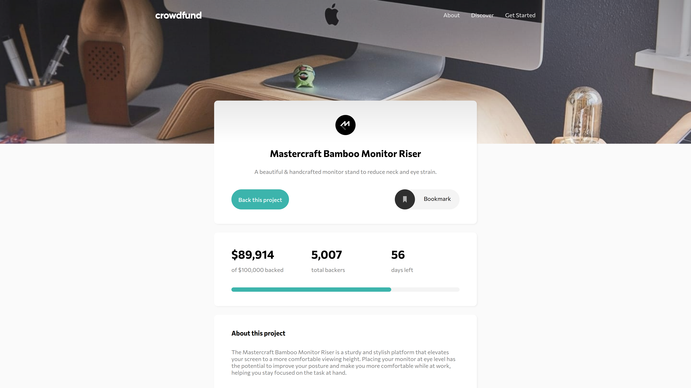

# Crowdfunding product page

> Live demo [https://jakubparlej.github.io/crowdfunding-product-page/](https://jakubparlej.github.io/crowdfunding-product-page/).

### Table of Contents

- [General info](#general-info)
- [Technologies](#technologies)
- [Features](#features)

## General info

Challenge was to build out this crowdfunding product page and get it looking as close to the design as possible.

## Technologies

Project is created with:

- HTML
- CSS

## Features

Users are able to:

- View the optimal layout depending on their device's screen size
- See hover states for interactive elements
- Make a selection of which pledge to make
- See an updated progress bar and total money raised based on their pledge total after confirming a pledge
- See the number of total backers increment by one after confirming a pledge
- Toggle whether or not the product is bookmarked

## Acknowledgements

This is the challenge from [frontendmentor.io](https://www.frontendmentor.io/solutions/crowdfunding-product-page-using-htmlcssjs-9sBOU0GDR)

## Contact

Created by [@jakubparlej](https://jprojects.pl) - feel free to contact me!
